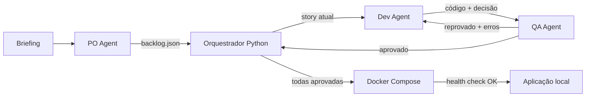

# Trilha B - Arquitetura simplificada

## Objetivo

Construir, em aproximadamente 5 horas, um MVP que demonstre os requisitos centrais da Trilha B:

- três agentes com papéis distintos;
- passagem explícita de contexto entre PO, Dev e QA;
- geração de backlog, código, decisões técnicas e relatório de QA;
- ciclo automático de correção quando o QA reprovar;
- aplicação gerada executando localmente.

O foco desta arquitetura é a pipeline. Não haverá frontend para acompanhar o squad. A execução será visível no terminal e auditável por arquivos.

## Decisão principal

Usar um script Python como orquestrador, sem LangGraph, MongoDB, filas, SSE ou microsserviços.

O PO é o único componente que recebe o briefing original. O Dev recebe apenas uma story por vez. O QA recebe a story, seus critérios de aceite e o código alterado pelo Dev.



## Componentes

### 1. Orquestrador

Um único arquivo `run.py` controla a ordem da execução. Ele não usa IA para decidir o fluxo; apenas aplica regras fixas:

1. chama o PO uma vez;
2. percorre as stories por prioridade;
3. chama Dev e depois QA para cada story;
4. se o QA reprovar, devolve os erros ao Dev;
5. permite no máximo duas correções por story;
6. quando todas forem aprovadas, testa, sobe o app e verifica `/health`;
7. encerra como `COMPLETED` ou `FAILED`.

Pseudocódigo:

```python
backlog = po.run(briefing)

for story in backlog:
    for attempt in range(1, 4):
        delivery = dev.run(story, last_qa_report)
        report = qa.run(story, delivery)

        if report.approved:
            mark_story_done(story)
            break

        last_qa_report = report
    else:
        fail_run(story)

deploy_generated_app()
health_check()
complete_run()
```

### 2. PO Agent

Entrada: briefing completo.

Saída: `backlog.json` com somente três stories prioritárias, uma para cada cenário obrigatório:

- registro ágil da não conformidade;
- causa raiz assistida e plano de ação;
- rastreabilidade de lote.

Cada story deve conter `id`, `title`, `description`, `priority` e critérios de aceite objetivos.

### 3. Dev Agent

Entrada: uma story, seus critérios e, quando houver, o último relatório de reprovação.

Saídas:

- arquivos criados ou alterados em `runs/<run_id>/app/`;
- uma entrada em `decisions.md` com decisão e justificativa;
- uma mensagem de entrega para o QA.

Para caber no prazo, o Dev não cria um projeto inteiro do zero. A pipeline copia `app_template/` para a pasta do run, e o agente implementa apenas os módulos necessários para a story.

### 4. QA Agent

Entrada: story, critérios de aceite e lista de arquivos alterados.

Responsabilidades:

- criar ou atualizar testes automatizados;
- executar os testes de verdade;
- relacionar cada critério de aceite a pelo menos um teste;
- aprovar somente se todos os critérios passarem;
- devolver ao Dev o comando executado e os erros quando reprovar.

Saída: uma seção por story em `qa-report.md` com casos, resultado, evidência textual e veredito.

## Estado mínimo

O estado será salvo em `state.json`. Não é necessário banco para o squad.

```json
{
  "run_id": "20260822-130000",
  "status": "EXECUTING",
  "current_story": "US-002",
  "stories": {
    "US-001": {"status": "DONE", "attempts": 1},
    "US-002": {"status": "IN_QA", "attempts": 2},
    "US-003": {"status": "TODO", "attempts": 0}
  }
}
```

### Estados do run

| Estado | Significado | Próximo estado |
|---|---|---|
| `RECEIVED` | Briefing recebido | `PLANNING` |
| `PLANNING` | PO gerando backlog | `EXECUTING` |
| `EXECUTING` | Stories passando por Dev e QA | `DEPLOYING` ou `FAILED` |
| `DEPLOYING` | Build, subida e health check | `COMPLETED` ou `FAILED` |
| `COMPLETED` | Todos os critérios atendidos | final |
| `FAILED` | Erro irrecuperável ou três reprovações | final |

### Estados de uma story

```text
TODO -> IN_DEV -> IN_QA -> DONE
          ^          |
          | REJECTED |
          +----------+

IN_QA -> FAILED, quando a terceira tentativa reprovar
```

Toda mudança de estado gera uma linha em `events.jsonl` e uma mensagem no terminal.

## Comunicação visível e auditável

Cada evento deve ter somente estes campos:

```json
{
  "timestamp": "2026-08-22T13:10:00Z",
  "from": "DEV",
  "to": "QA",
  "story_id": "US-001",
  "event": "DELIVERY",
  "summary": "Endpoint e formulário de não conformidade implementados"
}
```

Durante a demo, o terminal mostra a mesma informação:

```text
[PO -> DEV][US-001] Story priorizada e pronta
[DEV -> QA][US-001] Implementação entregue; testes solicitados
[QA -> DEV][US-001] REJECTED: campo turno não é obrigatório
[DEV -> QA][US-001] Correção entregue, tentativa 2
[QA -> ORCHESTRATOR][US-001] APPROVED: 5/5 testes passaram
```

Isso atende à comunicação visível sem exigir um console web.

## Critérios de passagem da pipeline

### PO -> Dev

- existem exatamente três stories cobrindo os três cenários do PDF;
- toda story possui prioridade e pelo menos dois critérios testáveis;
- os quatro campos de auditoria aparecem nos critérios do registro: data, responsável, turno e equipamento.

### Dev -> QA

- ao menos um arquivo de código foi criado ou alterado;
- a decisão técnica foi registrada em `decisions.md`;
- o app importa/inicializa sem erro;
- nenhuma alteração ocorreu fora da pasta do app gerado.

### QA -> Aprovado

- todos os critérios de aceite estão ligados a um caso de teste;
- todos os testes executados terminaram com exit code `0`;
- o resultado real do comando está salvo no relatório;
- nenhum critério pode ser aprovado apenas pela opinião do LLM.

### Deploy -> Concluído

- todas as stories estão em `DONE`;
- `docker compose build` termina com sucesso;
- `docker compose up -d` inicia o container;
- `GET /health` responde `200`;
- os três cenários possuem dados de demonstração.

## Aplicação gerada

A aplicação Rivexx será um monólito simples:

- FastAPI;
- páginas server-side com Jinja e CSS responsivo simples;
- SQLite em volume Docker;
- pytest;
- um único container.

O scaffold já deve conter configuração, conexão SQLite, layout HTML, Dockerfile, Compose e health check. O Dev Agent implementa apenas regras, rotas, templates e testes.

Modelo mínimo de dados:

- `nonconformities`: defeito, data, responsável, turno, equipamento e lote;
- `root_causes`: não conformidade, método, causa sugerida e causa confirmada;
- `action_plans`: causa, ação, responsável, prazo e status;
- `lots`: código, fornecedor, matéria-prima, equipamento, turno e operador;
- `lot_links`: relação entre lote de origem e lote produzido;
- `audit_events`: entidade, operação, responsável e data.

A sugestão de causa não precisa de embeddings ou outro agente. Para a demo, uma consulta por tipo de defeito e equipamento retorna as causas históricas mais frequentes. A rastreabilidade percorre `lot_links` em Python e devolve toda a cadeia.

## Deploy do código gerado

Estrutura produzida por cada execução:

```text
runs/<run_id>/
|-- app/
|   |-- main.py
|   |-- models.py
|   |-- routes/
|   |-- templates/
|   |-- tests/
|   |-- seed.py
|   |-- Dockerfile
|   `-- compose.yaml
|-- backlog.json
|-- decisions.md
|-- qa-report.md
|-- events.jsonl
`-- state.json
```

O próprio orquestrador executa:

```text
docker compose -f runs/<run_id>/app/compose.yaml run --rm app pytest
docker compose -f runs/<run_id>/app/compose.yaml up --build -d
GET http://localhost:8000/health
```

SQLite fica em um volume, portanto os dados sobrevivem à recriação do container. Para encerrar a demo: `docker compose down`.

## O que fica fora do MVP

- LangGraph ou outro framework de grafo;
- MongoDB e checkpointer;
- frontend React para o squad;
- SSE, filas e execução paralela;
- autenticação;
- controle de custo e tokens;
- múltiplos modelos de IA;
- geração completa do projeto do zero;
- deploy em nuvem.

## Plano de 5 horas

| Tempo | Entrega |
|---|---|
| 0:00-0:30 | Contratos JSON, estados, prompts e `app_template/` |
| 0:30-1:30 | Orquestrador, PO, logs e backlog |
| 1:30-2:30 | Dev Agent escrevendo no scaffold e log de decisões |
| 2:30-3:30 | QA Agent, execução de pytest e loop de correção |
| 3:30-4:15 | Docker Compose, seed e health check |
| 4:15-5:00 | Execução ponta a ponta, correções e ensaio da demo |

## Definição de pronto

O MVP está pronto quando um único comando recebe o briefing e, sem intervenção humana, produz:

1. backlog com três stories;
2. timeline auditável PO -> Dev -> QA;
3. código da aplicação em uma pasta isolada;
4. log de decisões do Dev;
5. relatório do QA com testes executados;
6. aplicação iniciada por Docker e respondendo ao health check.

Essa é a menor arquitetura que preserva os entregáveis obrigatórios do desafio.
