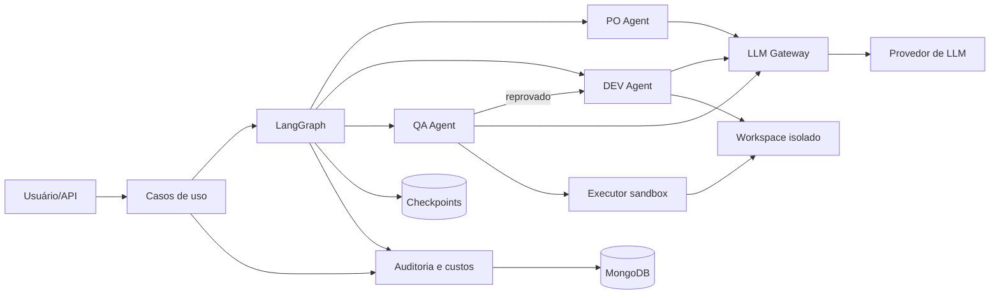
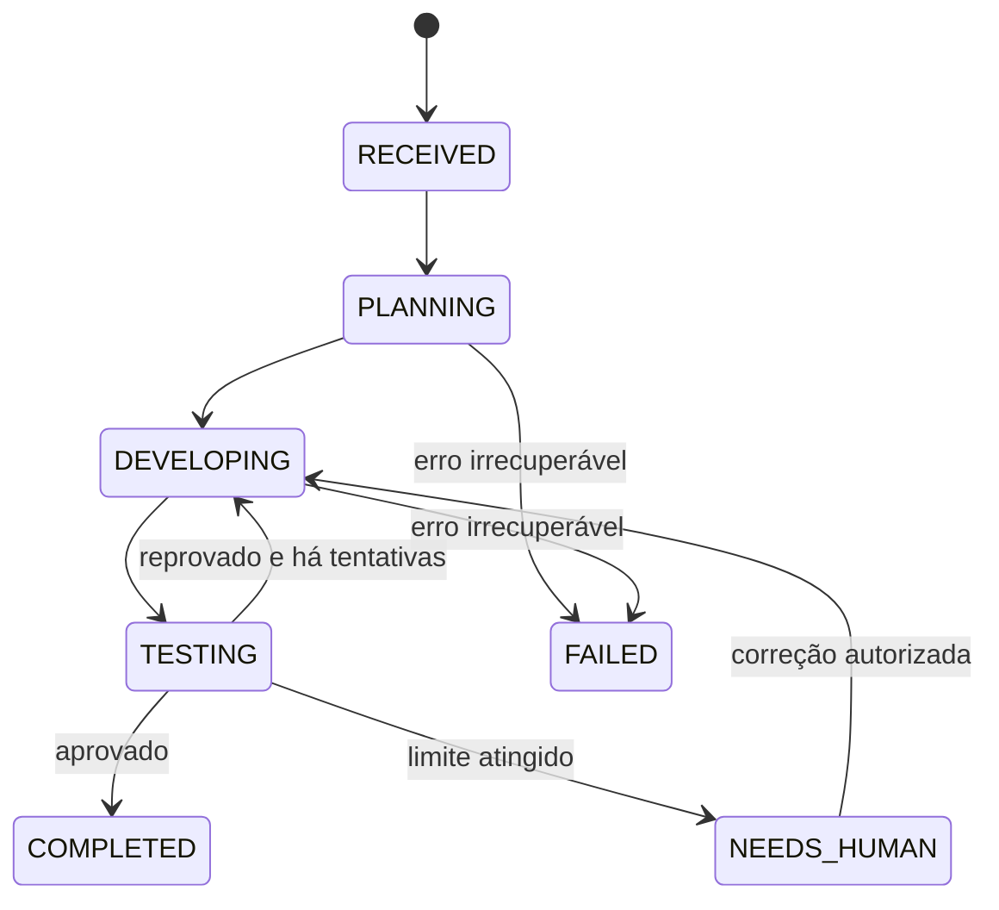
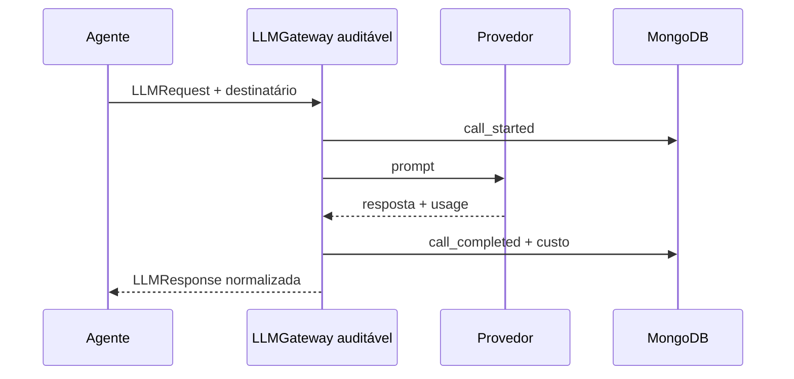

# Arquitetura do FullStack Agents

## 1. Visão geral

O MVP será um **monólito modular** em Python. LangGraph coordena o fluxo, MongoDB
guarda estado e auditoria, e adaptadores isolam provedores de LLM, execução de
código e persistência. Essa divisão permite começar simples e trocar detalhes sem
reescrever as regras do produto.



## 2. Fluxo principal



1. A API valida o pedido, seu modo de execução e cria o `run`, devolvendo `202 Accepted`.
2. Em `existing_project`, o sistema obtém uma cópia de trabalho e o DEV registra
   um diagnóstico antes de planejar mudanças. Em `new_project`, cria o workspace a
   partir do scaffold selecionado.
3. O PO transforma o prompt e o diagnóstico disponível em backlog e critérios de aceite.
4. O orquestrador envia uma história ao DEV.
5. O DEV altera o workspace e entrega evidências ao QA.
6. O QA executa os testes. Se reprovar, devolve erros ao DEV.
7. Quando todas as histórias forem aprovadas, o `run` termina e publica os
   artefatos. Limites de custo ou tentativas levam a intervenção humana.

## 3. Camadas e dependências

```text
routes/           entradas HTTP organizadas por recurso
    ↓
application/      casos de uso e portas
    ↓
domain/           entidades, regras e value objects

infrastructure/   implementa as portas de LLM, MongoDB, workspace e sandbox
pipeline/         adapta LangGraph aos casos de uso e contratos dos agentes
```

A regra é: dependências apontam para dentro. `domain/` não conhece FastAPI,
LangGraph, MongoDB ou SDKs. A composição concreta ocorre em uma factory no início
da aplicação.

### Componentes

| Componente | Responsabilidade |
|---|---|
| `RunSquad` | Iniciar, retomar, cancelar e consultar uma execução. |
| `SquadGraph` | Definir nós, transições, retries e checkpoints. |
| `Agent` | Executar um papel a partir de entrada e saída tipadas. |
| `LLMGateway` | Chamar o provedor e normalizar resposta e uso. |
| `AuditRecorder` | Gravar chamadas, handoffs e mudanças de estado. |
| `CostCalculator` | Calcular estimativa com preço versionado. |
| `RunRepository` | Persistir estado atual e projeções de consulta. |
| `ArtifactRepository` | Catalogar entregáveis e seus hashes. |
| `ProjectSource` | Validar e obter o projeto de origem em modo somente leitura. |
| `Workspace` | Criar a cópia por `run` e limitar leitura/escrita a ela. |
| `CodeExecutor` | Build e testes fora do processo principal. |

## 4. Contratos dos agentes

Todos os agentes implementam a mesma abstração, mas possuem contratos de entrada
e saída próprios. A saída do LLM é validada antes de alterar o estado do grafo.

```python
class Agent(Protocol):
    role: AgentRole
    async def execute(self, context: AgentContext) -> AgentResult: ...

class LLMGateway(Protocol):
    async def complete(self, request: LLMRequest) -> LLMResponse: ...
```

- PO: `ProductBrief -> Backlog`;
- DEV: `Story + AcceptanceCriteria + LastQAReport? -> Delivery`;
- QA: `Story + Delivery -> QAReport`.

Um `AgentResult` inclui dados estruturados, mensagens de handoff, artefatos e
evidências. Texto livre pode existir, mas não controla transições sem validação.

No modo `existing_project`, o DEV executa antes um contrato adicional:
`ProjectSnapshot -> ProjectDiagnosis`. O diagnóstico contém stack, gerenciador de
dependências, comandos de build/teste, arquivos relevantes, testes existentes e
estado Git. Ele é um artefato auditável e fornece contexto ao PO e ao DEV; segredos
são mascarados antes de serem enviados ao modelo.

## 4.1 Modos de trabalho do DEV

| Modo | Entrada | Workspace | Entrega |
|---|---|---|---|
| `new_project` | Prompt, backlog e scaffold selecionado | Diretório novo por `run` | Projeto completo, instruções e relatório de QA. |
| `existing_project` | Prompt, backlog e snapshot autorizado do repositório | Cópia de trabalho por `run`, derivada de uma revisão identificada | Diff, arquivos alterados, evidências de teste, instruções de aplicação e reversão. |

O snapshot de origem registra `repository_id`, `revision`, `branch` e hash do
conteúdo. A origem nunca é montada como gravável. No MVP, o usuário aplica o diff
ou abre um pull request manualmente; o squad não faz `push`, merge ou deploy.

## 5. Estado do LangGraph

O estado carrega somente referências e dados necessários ao fluxo; prompts e
respostas completos ficam na auditoria, evitando checkpoints enormes.

```python
class SquadState(TypedDict):
    run_id: str
    status: str
    backlog: list[Story]
    current_story_id: str | None
    current_attempt: int
    last_delivery_id: str | None
    last_qa_report_id: str | None
    spent_usd: str
    error: str | None
```

Nós previstos: `plan`, `select_story`, `develop`, `test`, `route_qa`,
`finalize` e `request_human`. Cada nó deve ser pequeno, idempotente e chamar um
caso de uso; o nó não contém regra de persistência ou de provedor.

## 6. Auditoria e custos

A auditoria acontece ao redor do `LLMGateway`, não dentro de cada agente. Assim,
uma chamada não escapa da medição quando novos papéis forem adicionados.



### Campos mínimos do item `LLM_CALL` na timeline

| Grupo | Campos |
|---|---|
| Identidade | `sequence`, `attempt`, `agent`, `correlation_id` |
| Comunicação | `request.from`, `request.to`, `request.prompt`, `request.system_prompt`, `response.content` |
| Modelo | `request.provider`, `request.model`, `request.parameters`, `request.effort` |
| Consumo | `input_tokens`, `output_tokens`, `cached_tokens`, `total_tokens` |
| Custo | `estimated_cost`, `billed_cost`, `currency`, `price_version` |
| Operação | `timestamp`, `brasil_datetime`, `started_at`, `finished_at`, `latency_ms`, `status`, `error` |
| Segurança | `redaction_applied`, `content_hash`, `retention_until` |

O evento `call_started` é gravado antes da chamada. O término atualiza a projeção
da chamada e acrescenta `call_completed` ou `call_failed` ao log de eventos. Uma
resposta parcial continua registrada como falha parcial. Custos são calculados
com `Decimal128` e tabela versionada por data de vigência.

Para um modelo precificado por milhão de tokens, a estimativa é:

```text
custo = (tokens_entrada / 1.000.000 × preço_entrada)
      + (tokens_saída   / 1.000.000 × preço_saída)
      + (tokens_cache   / 1.000.000 × preço_cache)
```

Campos não informados pelo provedor ficam `null`, nunca zero presumido. Isso evita
que ausência de telemetria seja interpretada como chamada gratuita.

### Convenção de data e hora

Cada chamada, evento, mudança de estado e artefato registra os dois campos abaixo,
criados a partir do mesmo instante pelo serviço de auditoria:

| Campo | Formato e uso |
|---|---|
| `timestamp` | UTC em ISO 8601, por exemplo `2026-08-25T18:30:00Z`. É a referência para ordenação, latência, índices e integração. |
| `brasil_datetime` | ISO 8601 no fuso IANA `America/Sao_Paulo`, por exemplo `2026-08-25T15:30:00-03:00`. É o valor principal em telas, exports e consultas humanas. |

O fuso é identificado por `America/Sao_Paulo`, e não por um deslocamento fixo
como `-03:00`; isso preserva corretamente qualquer alteração futura de regra de
horário. Os filtros de data recebidos pela API devem assumir Brasília quando o
usuário não informar fuso e ser convertidos para UTC antes da consulta.

## 7. Modelo de dados no MongoDB

O modelo detalhado e a proposta específica para o backend inicial estão em
[Modelo de dados MongoDB](modelo-dados-mongodb.md). Nesta primeira fase, há uma
única coleção `runs`, com pedido, auditoria e resultado embutidos no documento.
Coleções especializadas só devem ser introduzidas quando o volume de uma execução
se aproximar do limite de documento ou exigir consultas analíticas independentes.

| Coleção | Finalidade | Índices principais |
|---|---|---|
| `runs` | Um documento agregado: pedido, timeline de auditoria, resultado, estado e totais. | `_id`; `(status, timestamp)`; `(requested_by.id, timestamp)` |

O MongoDB não substitui armazenamento de arquivos grandes. O MVP pode usar disco
local no desenvolvimento; produção deve usar object storage e guardar apenas URI,
hash e metadados no MongoDB. Uma timeline só será movida a uma coleção separada
quando houver motivo de volume ou consulta, não por padrão. A configuração de
preços pode começar em arquivo/configuração da aplicação; cada chamada preserva no
próprio documento o valor e a versão efetivamente usados no cálculo.

## 8. Aplicação de SOLID

| Princípio | Aplicação prática |
|---|---|
| SRP | Agente decide seu papel; grafo coordena; gateway chama LLM; calculadora precifica; repositório persiste. |
| OCP | Novo agente, modelo ou persistência entra por implementação de porta, sem alterar casos de uso estáveis. |
| LSP | Fakes e adaptadores reais respeitam os mesmos contratos, erros e semântica de uso. |
| ISP | Portas pequenas (`LLMGateway`, `AuditWriter`, `Workspace`, `CodeExecutor`) evitam uma interface genérica gigante. |
| DIP | Casos de uso dependem de protocolos; SDKs, MongoDB e LangGraph são detalhes injetados na composição. |

Evitar duas abstrações prematuras: um framework genérico de “qualquer squad” e
microsserviços por agente. Ambos aumentariam a operação antes de existir demanda.

## 9. Segurança e limites

- chaves de API vêm de secret manager/variáveis de ambiente e nunca do estado;
- prompt e resposta podem conter dados sensíveis: acesso deve ser autorizado e
  todo acesso administrativo deve ser auditado;
- mascaramento ocorre antes da persistência, preservando hash do conteúdo original
  quando a política permitir;
- workspace é confinado por caminho, quota e prazo;
- um projeto existente é clonado/copiado de uma revisão autorizada, com origem
  somente leitura e cópia de trabalho descartável por `run`;
- testes/build rodam em container sem credenciais, com rede desabilitada por padrão,
  CPU/memória/tempo limitados e filesystem descartável;
- comandos permitidos são definidos pelo sistema, não pelo texto produzido pelo LLM;
- orçamento e número máximo de tentativas são verificados antes de cada chamada.

## 10. API mínima

| Método | Rota | Resultado |
|---|---|---|
| `POST` | `/runs` | Cria execução e devolve `202` com `run_id`. |
| `GET` | `/runs/{run_id}` | Estado, progresso e totais. |
| `GET` | `/runs/{run_id}/events` | Timeline paginada. |
| `GET` | `/runs/{run_id}/calls` | Resumo paginado das chamadas. |
| `GET` | `/runs/{run_id}/calls/{call_id}` | Prompt, resposta e custo detalhados. |
| `GET` | `/runs/{run_id}/artifacts` | Entregáveis e evidências. |
| `GET` | `/runs/{run_id}/changes` | Diff e metadados da alteração em projeto existente. |
| `POST` | `/runs/{run_id}/resume` | Retoma após decisão humana. |
| `POST` | `/runs/{run_id}/cancel` | Solicita cancelamento seguro. |

## 11. Estrutura inicial sugerida

```text
code/backend/
├── domain/              # entidades, regras e portas sem frameworks
├── application/         # casos de uso
├── agents/              # PO, DEV, QA, contratos e prompts versionados
├── pipeline/            # state, nodes, routers e montagem LangGraph
├── infrastructure/
│   ├── llm/             # provedores + gateway auditável
│   ├── persistence/     # MongoDB e checkpointer
│   ├── project_source/  # snapshot/cópia de projeto existente
│   ├── workspace/       # arquivos por run
│   └── execution/       # sandbox de build/testes
├── routes/              # FastAPI, por exemplo runs.py e health.py
└── tests/               # unit, integration e end-to-end
```

## 12. Estratégia de testes

- unitários: regras de orçamento, cálculo de custo, roteamento e contratos;
- contrato: todos os adaptadores de LLM/repositório passam pela mesma suíte;
- integração: MongoDB, checkpointer e índices;
- end-to-end: prompt → PO → DEV → QA, incluindo uma reprovação;
- segurança: tentativa de path traversal, timeout, rede e acesso a segredos;
- reconciliação: soma de tokens/custos das chamadas igual aos totais do `run`.

## 13. Evolução sugerida

1. Implementar o caminho feliz com adaptadores fake e memória.
2. Adicionar auditoria e testes de reconciliação antes do provedor real.
3. Conectar MongoDB e o checkpointer.
4. Conectar um provedor de LLM e validar custo real.
5. Isolar build/testes em container.
6. Criar interface de acompanhamento e intervenção humana.
7. Só então avaliar fila distribuída, múltiplos DEVs ou microsserviços.
