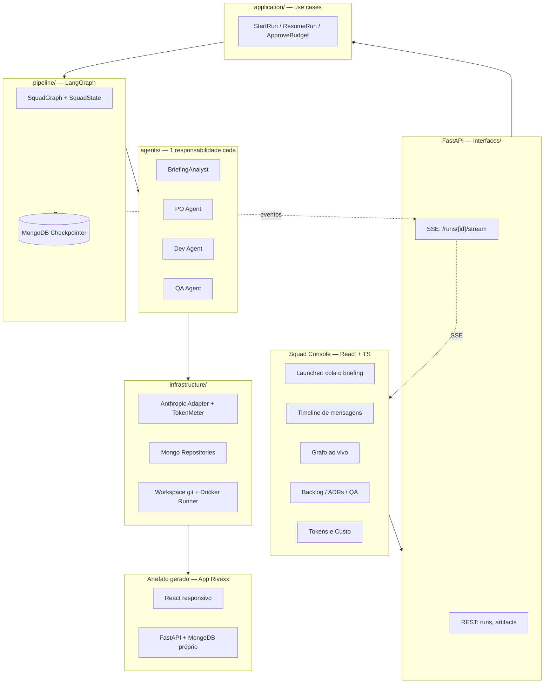
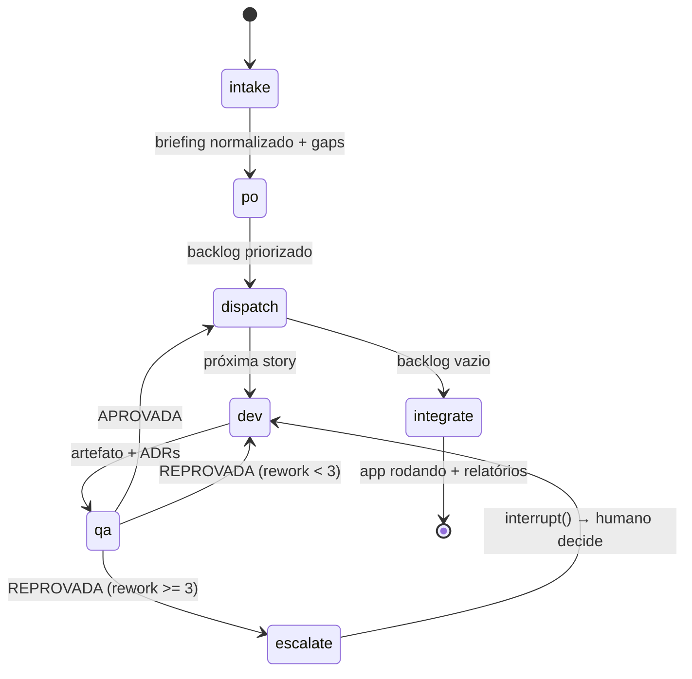

# Trilha B — Arquitetura Proposta

> Squad autônomo de agentes (Briefing → Backlog → Código → QA → App rodando)
> Stack: Python + FastAPI + LangGraph/LangChain + MongoDB + React/TS

---

## 1. A leitura do desafio: são DOIS sistemas

Esse é o ponto de partida arquitetural. O enunciado descreve dois softwares distintos, e tratá-los como um só é o erro que afunda a entrega:

| | **Sistema A — O Squad (meta-sistema)** | **Sistema B — O App Rivexx (produto)** |
|---|---|---|
| O que é | A esteira de agentes que produz software | Aplicação web de Não Conformidade / RCA / Rastreabilidade |
| Quem escreve | Nós (humanos) | O **Dev Agent** |
| É avaliado por | Orquestração **visível e auditável** | Cobrir os 3 cenários rodando localmente |
| Persistência | MongoDB (runs, mensagens, stories, ADRs, QA, tokens) | MongoDB próprio (NCs, lotes, ações) |
| Frontend | **Squad Console** (React) — auditoria, tokens, timeline | UI responsiva mobile-first (React) |

O `docs/Trilha B.pdf` diz explicitamente: *"Um output final sem orquestração visível não será considerado."* Ou seja: **o Sistema A vale mais nota que o Sistema B.** O Console de auditoria não é enfeite — é o entregável principal. O plano de implementação (§12) reflete essa prioridade.

Os dois sistemas nunca compartilham banco, processo ou código. O Sistema B é *artefato de saída* do Sistema A.

---

## 2. Decisões-chave (ADRs iniciais)

| # | Decisão | Escolha | Justificativa |
|---|---|---|---|
| ADR-01 | Persistência do Squad | **MongoDB** | Artefatos são documentos heterogêneos e versionados (briefing, story, ADR, test report). Precisamos de *query ad-hoc* + agregação para o Console e *Change Streams* para o feed ao vivo. |
| ADR-02 | Cassandra? | **Não** | Cassandra otimiza escrita massiva com padrão de query conhecido a priori. Aqui o volume é baixo (centenas de eventos por run) e a necessidade é o oposto: consulta exploratória e auditoria. Cassandra sem query pattern fixo é dívida pura. |
| ADR-03 | Orquestração | **LangGraph `StateGraph`** | Precisamos de grafo explícito, *checkpointer* durável, `interrupt()` para HITL e roteamento condicional (QA reprova → volta pro Dev). Um loop `while` caseiro não dá retomada nem inspeção de estado. |
| ADR-04 | Grafo do Rivexx (genealogia de lote) | **MongoDB `$graphLookup`** | Rastreabilidade é travessia recursiva (insumo → lote → produto). `$graphLookup` resolve em uma query, sem introduzir Neo4j. |
| ADR-05 | Modelo LLM | **`claude-opus-5`** (1M ctx) para todos os agentes | Codegen e decisão arquitetural são intelligence-sensitive. O dial de custo é `output_config.effort`, **não** trocar de modelo. |
| ADR-06 | Dev Agent gera código real? | **Sim — arquivos em disco, versionados em git** | O enunciado pede *"escreve o código"* + *"aplicação rodando localmente"*. UI dirigida por schema em runtime não é código escrito — é config. Ver §11 sobre como reduzir o risco disso. |
| ADR-07 | Etapa pré-PO | **Sim, `BriefingAnalyst`** — normaliza, não interpreta | Ver §5.1: resolve a tensão com *"PO é o único ponto de contato com o problema"*. |
| ADR-08 | Execução do código gerado | **Container Docker isolado**, sem rede host, timeout | Estamos executando código escrito por LLM. Não negociável. |
| ADR-09 | Pydantic no `domain/` | **Permitido** — stdlib + Pydantic, nada mais | Decidido durante a implementação. As entidades atravessam LLM, Mongo e HTTP em todo run; a alternativa purista custa ~7 mappers bidirecionais que apodrecem. Registrado em [adr/0009-pydantic-no-dominio.md](adr/0009-pydantic-no-dominio.md). |

---

## 3. Visão macro



**Regra de dependência (Clean Architecture):** as setas de dependência apontam sempre para dentro. `domain/` importa só stdlib e Pydantic (ADR-09). `application/` importa `domain/`. `infrastructure/` e `interfaces/` importam para dentro e implementam as *ports*. Nenhuma camada interna conhece FastAPI, Mongo, LangGraph ou Anthropic.

Na implementação isso deixou de ser convenção: a lista de imports banidos por camada está no `pyproject.toml` (regra `TID251` do ruff), e quebrar a regra derruba o CI. Ver [CONTRIBUTING.md](../CONTRIBUTING.md).

---

## 4. O grafo do squad (LangGraph)

### 4.1 Estado

O estado é o **contrato de integração entre agentes**. Tudo que um agente entrega para o outro passa por aqui — e por isso tudo é auditável de graça.

```python
# pipeline/state.py
from typing import Annotated, TypedDict
from operator import add

class SquadState(TypedDict):
    run_id: str
    raw_briefing: str
    briefing: NormalizedBriefing | None             # BriefingAnalyst
    backlog: list[Story]                            # PO Agent
    current_story_id: str | None
    artifacts: Annotated[list[Artifact], add]       # Dev Agent (reducer: append-only)
    test_reports: Annotated[list[TestReport], add]  # QA Agent
    adrs: Annotated[list[ADR], add]
    messages: Annotated[list[AgentMessage], add]    # trilha de auditoria
    rework: dict[str, int]                          # story_id -> nº de reprovações
    budget: BudgetSnapshot
```

Os `Annotated[..., add]` são o que garante que **nada é sobrescrito** — a trilha é append-only por construção do reducer, não por disciplina do programador.

### 4.2 Nós e arestas



- `dispatch` é **determinístico** (sem LLM): pega a próxima story pronta, verifica orçamento, decide fan-out.
- `qa → dev` é a aresta condicional que materializa o *"só libera o que estiver validado"* do enunciado.
- `escalate` usa `interrupt()` — 3 reprovações na mesma story pausa o run e pede decisão humana em vez de queimar tokens em loop.
- `integrate` também é determinístico: junta artefatos aceitos, roda migrations, sobe o app, gera os 3 relatórios.

### 4.3 Durabilidade e streaming

```python
# checkpointer no MESMO Mongo do audit store
from langgraph.checkpoint.mongodb.aio import AsyncMongoDBSaver

graph = builder.compile(checkpointer=saver)

# SSE para o Console
async for mode, chunk in graph.astream(
    inputs, config, stream_mode=["updates", "custom"]
):
    await event_bus.publish(run_id, mode, chunk)
```

Ganho concreto na demo: se o run quebrar (rate limit, container morto), `ResumeRun` retoma **do último nó**, não do zero. Em uma apresentação ao vivo isso é a diferença entre um soluço e um desastre.

Dentro dos nós, `get_stream_writer()` emite eventos de granularidade fina ("Dev Agent escrevendo `NCForm.tsx`") que alimentam a timeline.

---

## 5. Os agentes — responsabilidade única e contrato explícito

Todos implementam a mesma *port*, o que torna o registry substituível (LSP + OCP):

```python
# domain/ports/agent.py
class Agent(Protocol):
    role: AgentRole
    async def run(self, ctx: AgentContext) -> AgentResult: ...
```

### 5.1 BriefingAnalyst — o pré-PO

Você pediu a limpeza/enriquecimento antes do PO. **Está certo, mas tem uma armadilha:** o PDF diz que o PO Agent *"é o único ponto de contato com o problema do cliente"*. Se o Analyst interpretar o problema, ele invade o papel do PO e o avaliador pode cobrar isso.

A resolução é limitar o escopo do Analyst a **transformação sem interpretação**:

| ✅ Faz | ❌ Não faz |
|---|---|
| Estrutura o texto cru em campos (empresa, dores, restrições, atores) | Escrever requisito ou story |
| Extrai o glossário do domínio (lote, NC, turno, RCA, genealogia) | Decidir escopo ou prioridade |
| Lista **gaps e ambiguidades** como perguntas abertas | Responder essas perguntas |
| Anexa referência metodológica (5 Porquês, Ishikawa, 8D, rastreabilidade IATF/ISO 9001) | Escolher qual metodologia usar |
| Classifica restrições em funcional / não-funcional / compliance | Traduzir problema → solução |

**Saída:** `NormalizedBriefing { company, pains[], constraints[], actors[], glossary[], open_questions[], methodology_refs[] }`

O PO continua sendo o único que faz problema → solução. O Analyst só entrega o problema **legível**. Vale registrar isso como ADR no repo — é exatamente o tipo de decisão que o avaliador quer ver justificada.

### 5.2 Os três agentes obrigatórios

| Agente | Consome | Produz | Critério de pronto |
|---|---|---|---|
| **PO** | `NormalizedBriefing` | `Story[]` com `acceptance_criteria` em Gherkin, `priority` (MoSCoW), `scenario_tag` | Os 3 cenários do PDF cobertos; todo AC testável |
| **Dev** | uma `Story` | `Artifact` (arquivos) + `ADR[]` com alternativas consideradas | Código escreve em disco, compila, lint passa |
| **QA** | `Story` + `Artifact` | `TestReport` + `TestCase[]` + evidências | Todo AC tem ≥1 caso **executado** com resultado real |

Detalhes que importam:

- **AC em Gherkin não é preciosismo.** É o que permite ao QA gerar teste automaticamente e ao avaliador conferir o rastro AC → caso de teste → evidência. AC em prosa livre quebra a cadeia.
- **QA precisa *executar*, não opinar.** `TestRunnerPort` roda `pytest` (API) e `playwright` (UI) dentro do container e devolve JUnit XML + screenshots. Isso é literalmente a *"evidência de aceite"* que o PDF exige. Um QA Agent que só lê o código e diz "parece ok" não atende o enunciado.
- **ADR do Dev com alternativas.** O PDF pede *"cada decisão técnica com justificativa"*. Schema forçado: `{ decision, context, alternatives_considered[], rationale, consequences, story_ref }`. Sem `alternatives_considered`, "justificativa" vira racionalização.

### 5.3 Opcional: separar Architect do Dev

O PDF junta "decisões de arquitetura" e "escreve o código" no Dev Agent. Por SRP puro, seriam dois agentes. **Recomendo não separar:** aumenta latência e custo, adiciona um handoff a mais para falhar, e desvia do enunciado. Se quiser SRP interno sem novo agente, faça o Dev rodar em duas fases no mesmo nó (`plan` → `implement`) com o ADR emitido no fim da fase 1.

---

## 6. Camadas e SOLID

Aproveitando as pastas que já existem em `code/backend/` (`agents/`, `factory/`, `pipeline/`, `routes/`):

```
code/backend/
├── domain/                     # stdlib + Pydantic, nada além (ADR-09)
│   ├── entities/               # Story, Artifact, ADR, TestCase, AgentMessage, Run
│   ├── value_objects/          # AcceptanceCriterion, TokenUsage, Verdict, Priority
│   ├── enums.py                # AgentRole, MessageKind, RunStatus
│   ├── errors.py               # BudgetExceeded, ReworkLimitReached
│   └── ports/                  # Protocols — a fronteira de inversão
│       ├── agent.py            # Agent
│       ├── llm.py              # LLMPort
│       ├── repositories.py     # StoryRepo, ArtifactRepo, MessageRepo, ADRRepo...
│       ├── token_meter.py      # TokenMeterPort
│       ├── workspace.py        # CodeWorkspacePort
│       ├── test_runner.py      # TestRunnerPort
│       └── event_bus.py        # EventBusPort
│
├── application/                # casos de uso — orquestram, não decidem regra
│   ├── use_cases/              # StartRun, ResumeRun, ApproveBudget, GetRunTimeline
│   └── dto/
│
├── agents/                     # 1 pacote por agente + prompt + schema
│   ├── base.py                 # BaseAgent (template method: pré → LLM → valida → msg)
│   ├── briefing_analyst/       # agent.py | prompt.py | schema.py
│   ├── product_owner/
│   ├── developer/
│   └── qa/
│
├── pipeline/                   # LangGraph  (pasta que você já criou)
│   ├── state.py                # SquadState + reducers
│   ├── graph.py                # build_graph()
│   ├── nodes/                  # adapters finos: state -> use case -> state
│   └── routers.py              # arestas condicionais (qa_verdict, has_next_story)
│
├── factory/                    # composição / DI  (pasta que você já criou)
│   ├── container.py            # wiring único de toda a app
│   └── agent_registry.py       # AgentRole -> Agent
│
├── infrastructure/
│   ├── llm/                    # AnthropicAdapter, BudgetedLLM (decorator), CachedLLM
│   ├── persistence/mongo/      # repositórios + índices + change streams
│   ├── workspace/              # GitWorkspace, DockerSandbox, PytestRunner, PlaywrightRunner
│   └── observability/          # MongoTokenMeter, SSEEventBus
│
└── interfaces/                 # ex-routes/
    ├── http/routers/           # runs.py, artifacts.py, audit.py, metrics.py
    └── sse/
```

### SOLID, concretamente

- **SRP** — Um agente = um papel. Um nó do grafo = um adapter fino (traduz `SquadState` ↔ use case, sem regra). Regra de negócio nunca mora no nó.
- **OCP** — Adicionar um `SecurityAgent` = novo pacote em `agents/` + entrada no `agent_registry` + um nó. **Zero edição** em agente existente. O `BudgetedLLM` é decorator de `LLMPort`: adiciona orçamento sem tocar no adapter.
- **LSP** — Todo agente satisfaz `Agent.run(ctx) -> AgentResult`. O grafo não conhece agente concreto; o registry resolve por `AgentRole`. Trocar `AnthropicAdapter` por um `FakeLLM` determinístico nos testes é substituição limpa.
- **ISP** — Ports pequenos e segregados. `StoryRepository` ≠ `ArtifactRepository` ≠ `MessageRepository`. O QA Agent recebe `TestRunnerPort` e nada mais — ele não pode nem acidentalmente escrever código de produção, porque não tem a port pra isso. **A segregação de interface aqui é controle de escopo do agente, não só higiene de código.**
- **DIP** — `domain` e `application` dependem só de `Protocol`. O único lugar que conhece Mongo, Anthropic e Docker simultaneamente é `factory/container.py`.

---

## 7. Persistência — MongoDB

### 7.1 Banco do Squad (`squad_db`)

| Collection | Conteúdo | Índices | Escrita |
|---|---|---|---|
| `runs` | 1 doc por execução: status, briefing, timing, custo total | `_id`, `status`, `created_at` | update |
| `agent_messages` | **A trilha de auditoria.** Handoffs de negócio entre agentes | `(run_id, seq)`, `(run_id, from_agent)`, `ref` | **append-only** |
| `llm_calls` | Prompt e resposta crus, tokens, latência, cache hit | `(run_id, agent)`, `message_id` | **append-only** |
| `stories` | Backlog do PO (entregável) | `(run_id, priority)`, `scenario_tag` | update (status) |
| `adrs` | Log de decisões do Dev (entregável) | `(run_id, story_ref)` | append-only |
| `test_reports` | Relatório de QA + evidências (entregável) | `(run_id, story_ref)` | append-only |
| `checkpoints` | Estado do LangGraph (gerido pelo saver) | via lib | — |
| `token_ledger` | Consumo por run/agente/chamada | `(run_id, agent)` | append-only |

Change Streams em `agent_messages` alimentam o SSE do Console — a timeline atualiza sozinha, sem polling.

### 7.2 Banco do Rivexx (`rivexx_db`) — modelado pelo Dev Agent

Direção que o PO/Dev deve seguir para os 3 cenários:

- `nonconformities` — descrição, tipo, severidade, linha, **turno, responsável, equipamento, timestamp** (as 4 evidências que o cliente exige), fotos, `lot_refs[]`
- `root_cause_analyses` — método (5 Porquês / Ishikawa), árvore de causas, causa raiz confirmada, `nc_ref`
- `action_plans` — 5W2H, responsável, prazo, status, verificação de eficácia
- `lots` — código, tipo (insumo/intermediário/acabado), `parent_lot_ids[]`, fornecedor, equipamento, turno, operadores, qty
- `audit_log` — append-only, imutável (*"todo registro com evidência auditável"*)

**Rastreabilidade em segundos** = `$graphLookup` sobre `lots.parent_lot_ids` (ancestrais: de onde veio) + a mesma query invertida (descendentes: quais lotes/clientes foram afetados). Índice em `code` e `parent_lot_ids`. Sem isso, o cenário 3 não fecha.

> **Seed obrigatório.** Rastreabilidade e "sugestão de causas baseada no histórico" só demonstram valor com dados. Sem um seed sintético (2 plantas, 3 turnos, ~200 lotes com genealogia, ~50 NCs históricas), as duas telas ficam vazias e o cenário não é avaliável. Isso é **nosso** trabalho, entra como fixture do scaffold — não pedir ao agente.

---

## 8. Auditoria, tokens e observabilidade

Aqui mora a nota. Dois níveis distintos, e a distinção importa:

### 8.1 Nível de negócio — o envelope de mensagem

É o que o avaliador lê para *"enxergar o squad trabalhando junto"*:

```python
# domain/entities/agent_message.py
@dataclass(frozen=True)
class AgentMessage:
    id: str
    run_id: str
    seq: int                      # ordem total dentro do run
    from_agent: AgentRole
    to_agent: AgentRole
    kind: MessageKind             # HANDOFF | DELIVERY | REJECTION | QUESTION | DECISION
    ref: str | None               # story_id / artifact_id
    summary: str                  # 1 linha legível por humano
    payload: dict                 # o artefato tipado
    rationale: str                # POR QUE — o que torna a decisão auditável
    usage: TokenUsage
    created_at: datetime
```

Todo agente é **obrigado** a emitir a mensagem — está no `BaseAgent` (template method), não na boa vontade de cada implementação. Um agente que não emite não completa o `run()`.

### 8.2 Nível técnico — o log de chamadas

`llm_calls` guarda prompt e resposta crus (a "auditoria dos envios e respostas" que você pediu), com `prompt_hash` para detectar quebra de cache, `latency_ms` e `cache_read_input_tokens`. O Console mostra lado a lado: **envelope de negócio** ↔ **prompt/resposta que o gerou**. É isso que separa "confia em mim" de auditável.

### 8.3 Controle de tokens

```python
class BudgetedLLM(LLMPort):          # decorator — OCP na prática
    def __init__(self, inner: LLMPort, meter: TokenMeterPort): ...

    async def complete(self, req):
        self._meter.assert_within_budget(req.run_id, req.agent)   # → BudgetExceeded
        res = await self._inner.complete(req)
        self._meter.record(req.run_id, req.agent, res.usage)
        return res
```

- Orçamento em **3 escopos**: por run, por agente, por chamada.
- `BudgetExceeded` não mata o run — o roteador manda para `escalate` → `interrupt()` → humano aprova extensão. Falha graciosa, e fica visível no Console.
- Pré-medição com `client.messages.count_tokens` antes de disparar (nunca `tiktoken` — tokenizer errado dá número errado).
- Custo em USD calculado no ledger: `claude-opus-5` a **$5 / MTok input, $25 / MTok output**.

### 8.4 O que puxa o custo para baixo (sem trocar de modelo)

1. **Prompt caching.** O prefixo por agente (system + few-shots + glossário do briefing) é estável e grande — candidato ideal a `cache_control: {"type": "ephemeral"}`. Regra crítica: **conteúdo estável primeiro, volátil depois do último breakpoint.** Um `datetime.now()` no system prompt invalida tudo silenciosamente. Validar sempre por `usage.cache_read_input_tokens` — se vier zero em chamadas repetidas, há um invalidador escondido.
2. **`output_config.effort`** como dial por agente, em vez de downgrade de modelo: `high`/`xhigh` para Dev (codegen), `medium` para QA e Analyst, `high` para PO. Mantém a capacidade e corta tokens de raciocínio.
3. **Structured output** (`output_config.format`, ou tool com `strict: true`) elimina retry de parsing — que é custo puro e invisível.
4. **Adaptive thinking** (`thinking: {"type": "adaptive"}`) no Dev. Atenção: em `claude-opus-5` o thinking já vem ligado por padrão, e `budget_tokens` foi **removido** (retorna 400 se enviado).

> Nota de integração: `ChatAnthropic` do `langchain-anthropic` com `.with_structured_output(Schema)` cobre o caso comum. Para `effort`, breakpoints de cache e `count_tokens`, o `AnthropicAdapter` fala com o SDK `anthropic` direto — a port `LLMPort` esconde essa escolha do resto do sistema. Vale conferir a versão do `langchain-anthropic` antes de assumir que ele repassa esses parâmetros.

---

## 9. Frontend — Squad Console

React + TypeScript + Vite, TanStack Query, hook de SSE, React Flow para o grafo.

| Tela | Serve para | Fonte |
|---|---|---|
| **Launcher** | Colar o briefing, definir orçamento, disparar | `POST /runs` |
| **Grafo ao vivo** | Nós acendendo conforme executam — a "orquestração visível" | SSE `updates` |
| **Timeline** | Lista cronológica de `AgentMessage`, filtrável por agente/tipo | `agent_messages` |
| **Inspector** | Envelope + prompt/resposta crus + tokens da chamada | `llm_calls` |
| **Backlog** | Board de stories com AC em Gherkin | entregável PO |
| **Decision Log** | ADRs com alternativas consideradas | entregável Dev |
| **QA Report** | Casos, pass/fail, screenshots, cobertura AC→teste | entregável QA |
| **Tokens e Custo** | Consumo por agente, cache hit rate, USD, orçamento restante | `token_ledger` |
| **App Preview** | Link/iframe para o Rivexx rodando | `integrate` |

Uma sugestão de UX que rende na apresentação: no Inspector, mostrar **diff do estado** antes/depois de cada nó. O avaliador vê contexto sendo passado, não só resultado aparecendo.

---

## 10. Mapeamento entregáveis → artefatos

| Entregável (PDF) | Onde vive | Como se prova |
|---|---|---|
| Squad funcional com comunicação visível | `agent_messages` + Timeline + Grafo | Console ao vivo |
| App web rodando local, 3 cenários | `workspace/<run_id>/` + Docker | `docker compose up`, App Preview |
| Backlog gerado pelo PO | `stories` | Tela Backlog + export MD |
| Log de decisões técnicas do Dev | `adrs` | Decision Log + `docs/adr/` no workspace |
| Relatório de QA com evidências | `test_reports` | QA Report + JUnit XML + screenshots |

Todos exportáveis em Markdown/JSON — o avaliador pode querer levar os arquivos, não só ver a tela.

---

## 11. Riscos e mitigações

| Risco | Severidade | Mitigação |
|---|---|---|
| **Codegen autônomo é flaky** — é o que mais afunda essa trilha | Alta | **Scaffold curado.** Nós entregamos o esqueleto pronto: stack fixa, design system, roteador, conexão Mongo, seed, harness de teste. O Dev Agent preenche só telas/endpoints/schemas. Reduz a superfície de geração de ~100% para ~20% e mantém "escreve o código" verdadeiro. |
| Loop infinito Dev↔QA | Média | `rework` no state, limite 3, então `interrupt()` |
| Estouro de orçamento | Média | `BudgetedLLM` + escalação com aprovação humana |
| Código gerado hostil | Alta | Docker sem rede host, path allowlist, timeout, sem montar `.env` real |
| Run quebra na demo | Média | Checkpointer Mongo + `ResumeRun`; **e gravar um run de referência completo** como fallback de apresentação |
| Telas vazias nos cenários 2 e 3 | Média | Seed sintético de lotes/NCs (§7.2) |
| Rastreabilidade lenta | Baixa | Índice em `code` + `parent_lot_ids`; `$graphLookup` com `maxDepth` |
| Analyst invadindo papel do PO | Média | Escopo restrito (§5.1) + ADR registrando a decisão |

---

## 12. Plano de implementação

Ordenado por **nota**, não por dependência técnica — o Sistema A vale mais que o Sistema B.

**Fase 0 — Fundação**
`domain/` completo (entidades + ports), `factory/container.py`, Mongo + índices, `AnthropicAdapter` + `BudgetedLLM` + `MongoTokenMeter`.

**Fase 1 — Esqueleto do grafo** ⭐ *maior peso na avaliação*
`SquadState` + reducers, `build_graph()` com os 5 nós, checkpointer, `EventBus` + SSE. Agentes ainda *stubs* determinísticos — mas o **envelope de mensagem já real e persistido**. Ao fim da fase o Console já mostra orquestração; isso destrava a demo antes de qualquer LLM entrar.

**Fase 2 — Console**
Launcher, Grafo, Timeline, Inspector, Tokens. Feito contra os stubs.

**Fase 3 — Agentes reais**
Um por vez, cada um com `FakeLLM` nos testes: Analyst → PO → QA → Dev. Dev por último porque é o mais difícil e o que mais se beneficia dos outros já estáveis.

**Fase 4 — Scaffold Rivexx + seed**
Esqueleto curado, seed sintético, `TestRunnerPort` (pytest + playwright), `DockerSandbox`.

**Fase 5 — Ensaio**
Rodar os 3 cenários ponta a ponta, ajustar prompts, medir custo/latência, gravar o run de referência.

---

## 13. Perguntas abertas

1. **Escopo do codegen** — scaffold curado (ADR-06 + §11) ou geração from-scratch? Recomendo curado; muda bastante o esforço.
2. **Fan-out de stories** — paralelizar via `Send` (mais impressionante, timeline mais confusa) ou sequencial (mais legível na demo)? Recomendo sequencial na demo, com `Send` como capacidade demonstrável.
3. **Orçamento** — teto de USD por run, para calibrar `effort` e limites?
4. **Docker disponível** no ambiente de apresentação? Se não, o sandbox cai para `subprocess` + venv isolado, com garantias mais fracas.
5. **Auth no Console** — a trilha não pede. Assumo aberto em localhost. Confirmar.
