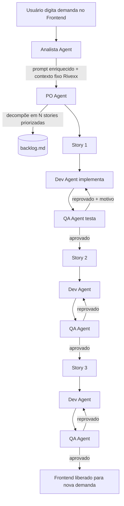

# Design Arquitetural — Squad de Agentes de IA (Trilha B / Rivexx)

**Data:** 2026-08-22
**Status:** Aprovado para implementação

---

## 1. Contexto do desafio

O time precisa entregar um squad autônomo de agentes de IA que, a partir de uma demanda de
negócio, entenda o problema, quebre em stories, escreva código, teste e entregue uma
aplicação funcional — com orquestração e comunicação entre agentes visível e auditável.

**Cliente fictício:** Rivexx Componentes (indústria de componentes plásticos de alta precisão,
2 plantas, setores automotivo/eletroeletrônico, 480 colaboradores, 3 turnos).

**Problema do cliente:** não conformidades disparam investigações manuais lentas; informação
espalhada em papel/planilhas/memória; causa raiz vira opinião; planos de ação sem
monitoramento; rastreabilidade de lote não existe de forma centralizada.

**Entregáveis obrigatórios do desafio:**
- Squad funcional com agentes orquestrados e comunicação visível entre eles
- Aplicação web rodando localmente cobrindo 3 cenários (registro ágil, causa raiz assistida,
  rastreabilidade de lote)
- Backlog gerado pelo PO Agent
- Log de decisões técnicas do Dev Agent
- Relatório de QA com casos executados e evidências de aceite

**Restrição de prazo:** curto (poucas horas) — o escopo prioriza o mínimo viável que cobre os
3 cenários obrigatórios, sem funcionalidades extras não pedidas.

---

## 2. Objetivo desta arquitetura

Construir o squad usando **LangGraph**, com 4 agentes (Analista, PO, Dev, QA) e um **frontend
próprio** que serve tanto de canal de entrada de demandas quanto de painel de observação da
orquestração — e que, como diferencial, permite ao usuário pedir novas funcionalidades além
das 3 obrigatórias, sempre no contexto da Rivexx.

---

## 3. Visão geral do fluxo



**Regra geral:** toda submissão do frontend — seja a primeira (obrigatória) ou qualquer demanda
extra depois — passa pela cadeia completa **Analista → PO → (Dev ⇄ QA)\***. O PO decide quantas
stories aquela submissão precisa; cada story roda seu próprio ciclo Dev⇄QA até ser aprovada (ou
até esgotar tentativas) antes da próxima começar.

---

## 4. Componentes

### 4.1 Frontend

- Aplicação Next.js simples com:
  - Campo de texto para o usuário digitar a demanda.
  - Painel de log em tempo real mostrando as mensagens/decisões trocadas entre os agentes
    (atende ao requisito de "comunicação explícita e auditável").
  - Área para visualizar a aplicação sendo construída (as telas geradas ficam navegáveis à
    medida que são aprovadas).
- **Primeira submissão obrigatória** (fixa, digitada pelo usuário exatamente assim):

  > "Uma aplicação web interna que centralize o registro de não conformidades, conduza a
  > análise de causa raiz com metodologia estruturada, gere e monitore planos de ação
  > corretiva — e permita rastrear qualquer lote em segundos, do insumo recebido ao produto
  > expedido."

- **Submissões seguintes:** livres, novas demandas de funcionalidade, dentro do contexto da
  Rivexx (o diferencial do squad).

### 4.2 Contexto fixo embutido (Rivexx)

- Os parágrafos "Empresa" e "O problema" do briefing ficam armazenados como contexto fixo
  (arquivo `rivexx_context.md` carregado no backend), **não digitados pelo usuário**.
- Esse contexto é injetado automaticamente em todo prompt do Analista, garantindo que o
  sistema sempre "sabe" que está tratando da Rivexx, mesmo em demandas curtas.

### 4.3 Analista Agent (novo papel)

- **Entrada:** texto cru do usuário (frontend).
- **Função:**
  1. Enriquecer o texto com o contexto fixo da Rivexx (empresa + problema).
  2. Considerar o estado acumulado (o que já existe no backlog/app), para não duplicar.
  3. Atuar como **gatekeeper de escopo**: se a demanda não fizer sentido no domínio de
     qualidade/manufatura da Rivexx, sinaliza isso e devolve uma explicação ao usuário em vez
     de repassar ao PO.
- **Saída:** prompt estruturado e completo para o PO Agent.
- **Ferramentas:** nenhuma execução — só LLM, com leitura do contexto fixo e do estado.

### 4.4 PO Agent

- **Entrada:** prompt enriquecido do Analista.
- **Função:** interpretar o problema e decidir quantas user stories são necessárias. Na
  primeira submissão (que junta 3 pedidos num parágrafo só), decompõe em 3 stories
  independentes:
  1. Registro ágil de não conformidade
  2. Causa raiz assistida + plano de ação corretivo
  3. Rastreabilidade de lote
- Cada story tem critérios de aceite claros e testáveis.
- **Saída:** atualiza `backlog.md` (priorizado) e entrega as stories uma a uma para o Dev.
- **Ferramentas:** escrita de arquivo (`backlog.md`).

### 4.5 Dev Agent

- **Entrada:** uma story com critérios de aceite (ou, em caso de retrabalho, também o motivo
  de reprovação do QA + o código anterior).
- **Função:** tomar decisões de arquitetura e implementar a story no projeto
  FastAPI + Next.js + SQLite já existente (incremental — não recomeça do zero a cada story).
- Registra cada decisão técnica com justificativa em `decisions_log.md`.
- **Ferramentas:** escrita real de arquivos, execução de comandos (instalação de dependências,
  migrations, etc.).

### 4.6 QA Agent

- **Entrada:** entrega do Dev + critérios de aceite da story.
- **Função:** escrever e executar testes reais (pytest no backend; testes leves de
  componente no frontend) contra os critérios de aceite.
- **Saída:** veredito passa/falha com evidências, registrado em `qa_report.md`.
  - Se **falha**: motivo estruturado (qual critério, o que quebrou) volta para o Dev.
  - Se **passa**: story é liberada, segue para a próxima.
- **Regra de corte:** máximo de 3 tentativas de retrabalho por story. Se estourar, a story é
  marcada como "bloqueada" no relatório de QA e o processamento segue para a próxima story,
  para não travar a demo.
- **Ferramentas:** escrita/execução de testes, subida pontual da aplicação para validação.

---

## 5. Estado compartilhado (LangGraph)

```python
class SquadState(TypedDict):
    rivexx_context: str          # empresa + problema, fixo, carregado uma vez
    raw_input: str                # texto digitado pelo usuário nessa submissão
    enriched_prompt: str          # saída do Analista
    in_scope: bool                # resultado do gatekeeper do Analista
    backlog: list[Story]          # acumulado entre todas as submissões
    current_story: Story
    dev_output: DevDelivery       # arquivos alterados + resumo da decisão
    qa_verdict: QAVerdict         # pass/fail + motivo + evidências
    retry_count: int
    decisions_log: list[str]
    qa_report: list[str]
```

---

## 6. Modelo de dados da aplicação gerada

Tabelas mínimas, populadas com dados fictícios (seed) para a rastreabilidade funcionar na
demo sem integração externa:

- `nao_conformidades` (defeito, linha, lote, turno, equipamento, responsável, evidência)
- `lotes`
- `materias_primas`
- `fornecedores`
- `equipamentos`
- `turnos`
- `operadores`
- `planos_acao` (vinculado à análise de causa raiz)

---

## 7. Escopo funcional das 3 telas obrigatórias

1. **Registro ágil** → formulário responsivo (defeito, linha, lote, turno, equipamento,
   responsável, evidência/foto).
2. **Causa raiz assistida** → tela de análise estruturada (ex.: 5 Porquês ou Ishikawa
   simplificado), com sugestão de causas baseada em não conformidades anteriores no banco, e
   geração automática de plano de ação.
3. **Rastreabilidade de lote** → busca por código de lote que junta matéria-prima,
   fornecedor, equipamento, turno, operadores e lotes correlatos.

---

## 8. Diferencial: demandas extras

Após a primeira submissão (obrigatória) ser processada e aprovada, o campo do frontend
permanece aberto. O usuário pode digitar novas demandas de funcionalidade; cada uma passa
pela mesma cadeia (Analista → PO → Dev⇄QA), sempre entendendo o contexto da Rivexx. O
Analista valida se a demanda faz sentido no domínio antes de repassá-la ao PO.

---

## 9. Stack técnica

- **Orquestração do squad:** LangGraph (Python)
- **Aplicação gerada:** Next.js (frontend) + FastAPI (backend) + SQLite (banco)
- **Testes:** pytest (backend), testes leves de componente (frontend)
- **Execução local:** scripts simples de start (sem Docker, dado o prazo curto)

---

## 10. Entregáveis finais

- `backlog.md` — gerado pelo PO Agent
- `decisions_log.md` — gerado pelo Dev Agent
- `qa_report.md` — gerado pelo QA Agent, com casos executados e evidências
- Frontend + backend rodando localmente
- Log de orquestração visível na própria interface do frontend

---

## 11. Fora de escopo (YAGNI, dado o prazo curto)

- Docker/containerização
- Autenticação/autorização de usuários
- Integração com sistemas reais da Rivexx (ERP, MES, etc.)
- Deploy em nuvem
- Suporte a múltiplos idiomas na interface

---

## 12. Riscos e mitigação

| Risco | Mitigação |
|---|---|
| Loop Dev⇄QA infinito | Limite de 3 tentativas; story bloqueada segue para a próxima |
| Demanda extra fora de escopo | Analista atua como gatekeeper e explica a rejeição |
| Prazo curto vs. complexidade dos 3 cenários | Escopo mínimo viável definido na seção 7; sem features extras não pedidas |
| Dados de rastreabilidade inexistentes na demo | Banco populado com dados seed antes da demo |
