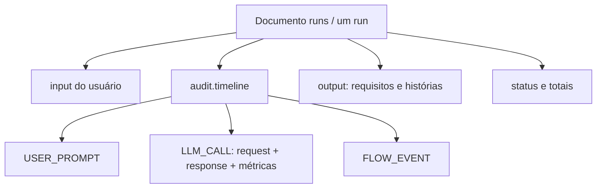

# Modelo de dados MongoDB — MVP PO auditável

## 1. Decisão: um documento por execução

Para o primeiro backend existe um único agente PO e, normalmente, uma chamada ao
modelo por solicitação. Portanto, o MongoDB deve guardar **um documento agregado
por `run`**. Nele ficam o pedido, as mensagens, a chamada ao LLM, o fluxo e o
resultado estruturado.

Isso explora o modelo de documentos: ao abrir um `run`, a API já tem toda a sua
história, sem joins, referências obrigatórias ou consultas a várias coleções.



## 2. Documento `runs`

```json
{
  "_id": "run_01J...",
  "flow": "product_owner_v1",
  "status": "COMPLETED",
  "requested_by": {
    "id": "user_123",
    "type": "user",
    "display_name": "Thiago"
  },
  "input": {
    "content": "Quero criar um sistema para...",
    "recipient": {"id": "po", "role": "PRODUCT_OWNER"},
    "timestamp": "Date",
    "brasil_datetime": "2026-08-25T15:30:00-03:00",
    "timezone": "America/Sao_Paulo"
  },
  "audit": {
    "timeline": [],
    "totals": {
      "input_tokens": 1200,
      "output_tokens": 800,
      "total_tokens": 2000,
      "estimated_cost": {"amount": "0.004800", "currency": "USD"},
      "llm_latency_ms": 2300
    }
  },
  "output": {
    "summary": "...",
    "requirements": [],
    "user_stories": [],
    "assumptions": [],
    "open_questions": []
  },
  "timestamp": "Date",
  "brasil_datetime": "2026-08-25T15:30:00-03:00",
  "timezone": "America/Sao_Paulo",
  "finished_at": {
    "timestamp": "Date",
    "brasil_datetime": "2026-08-25T15:30:03-03:00",
    "timezone": "America/Sao_Paulo"
  },
  "version": 1
}
```

`timestamp` é um `Date` BSON em UTC e é a fonte técnica para índices e filtros.
`brasil_datetime` é string ISO 8601 no fuso `America/Sao_Paulo`; é o horário
principal de telas, exports e auditorias humanas. Os dois representam o mesmo
instante e são sempre gravados juntos.

> `amount` aparece como string nos exemplos somente para legibilidade. Na
> persistência, custo é `Decimal128`, nunca `float`.

## 3. `audit.timeline`: uma linha do tempo embutida

A array `audit.timeline` preserva a ordem completa dos fatos do run. Cada item tem
campos comuns (`sequence`, horários, tentativa e correlação) e um `type` que define
seus campos específicos. É uma timeline, não uma tabela disfarçada.

### 3.1 Entrada enviada pelo usuário

```json
{
  "sequence": 1,
  "type": "USER_PROMPT",
  "from": {"type": "user", "id": "user_123", "display_name": "Thiago"},
  "to": {"type": "agent", "id": "po", "role": "PRODUCT_OWNER"},
  "content": "Quero criar um sistema para...",
  "attempt": 1,
  "timestamp": "Date",
  "brasil_datetime": "2026-08-25T15:30:00-03:00",
  "timezone": "America/Sao_Paulo"
}
```

Este item responde diretamente: **quem enviou, para quem, o que enviou e quando**.

### 3.2 Chamada e resposta do LLM

Pedido e resposta ficam juntos porque são duas faces da mesma chamada física ao
modelo. Não há `message_id` ou referência cruzada para resolver.

```json
{
  "sequence": 3,
  "type": "LLM_CALL",
  "attempt": 1,
  "agent": {"id": "po", "role": "PRODUCT_OWNER", "version": "1.0.0"},
  "request": {
    "from": {"type": "agent", "id": "po"},
    "to": {"type": "llm_provider", "id": "openai"},
    "prompt": "Prompt final enviado ao modelo...",
    "system_prompt": "Você é um Product Owner...",
    "system_prompt_version": "po-v1",
    "model": "modelo-configurado",
    "provider": "openai",
    "parameters": {"temperature": 0.2, "max_output_tokens": 4000},
    "effort": "medium"
  },
  "response": {
    "from": {"type": "llm_provider", "id": "openai"},
    "to": {"type": "agent", "id": "po"},
    "content": "Requisitos e histórias em formato estruturado...",
    "finish_reason": "stop"
  },
  "usage": {
    "input_tokens": 1200,
    "output_tokens": 800,
    "cached_tokens": 0,
    "total_tokens": 2000
  },
  "cost": {
    "estimated": {"amount": "0.004800", "currency": "USD", "price_version": "2026-08"},
    "billed": null
  },
  "started_at": {"timestamp": "Date", "brasil_datetime": "2026-08-25T15:30:01-03:00", "timezone": "America/Sao_Paulo"},
  "finished_at": {"timestamp": "Date", "brasil_datetime": "2026-08-25T15:30:03-03:00", "timezone": "America/Sao_Paulo"},
  "latency_ms": 2300,
  "status": "SUCCEEDED",
  "error": null
}
```

Este item contém tudo o que foi pedido para a resposta: tokens, quem respondeu,
conteúdo, demora, prompt recebido, modelo, agente, system prompt e `effort`.
Quando o provedor não fornecer algum valor, ele fica `null`; nunca é inventado ou
substituído por zero.

### 3.3 Eventos do fluxo

```json
{
  "sequence": 4,
  "type": "FLOW_EVENT",
  "event": "AGENT_RESULT_ACCEPTED",
  "from": {"type": "agent", "id": "po", "role": "PRODUCT_OWNER"},
  "to": {"type": "orchestrator", "id": "product_owner_graph"},
  "state_before": "PLANNING",
  "state_after": "COMPLETED",
  "attempt": 1,
  "approved": true,
  "summary": "Resultado do PO contém requisitos e histórias válidas",
  "timestamp": "Date",
  "brasil_datetime": "2026-08-25T15:30:03-03:00",
  "timezone": "America/Sao_Paulo"
}
```

Tipos iniciais de evento: `RUN_CREATED`, `FLOW_STARTED`, `LLM_CALL_STARTED`,
`LLM_CALL_SUCCEEDED`, `LLM_CALL_FAILED`, `AGENT_RESULT_ACCEPTED`,
`AGENT_RESULT_REJECTED`, `STATE_CHANGED` e `RUN_COMPLETED`.

## 4. Por que este modelo é melhor para agora

| Antes | Proposta atual |
|---|---|
| Várias coleções ligadas por IDs | Uma coleção `runs`, um documento completo por execução |
| Recuperar auditoria exigia várias consultas | `findOne({_id: run_id})` devolve toda a história |
| Prompt e resposta podiam ficar separados | Pedido e resposta de LLM estão no mesmo item de timeline |
| Estrutura genérica cedo demais | Schema pequeno, adequado a um PO e uma chamada |

## 5. Índices e validação

Para o MVP, apenas a coleção `runs` é necessária:

```text
{ _id: 1 }                                      // padrão
{ status: 1, timestamp: -1 }                    // lista de execuções
{ "requested_by.id": 1, timestamp: -1 }        // histórico de um usuário
{ brasil_datetime: -1 }                         // relatórios visuais por Brasília
```

A validação JSON Schema deve exigir `status`, solicitante, `input`, horários,
`audit.timeline`, `audit.totals` e `output` quando o run estiver `COMPLETED`.
Também deve exigir `sequence` único e crescente dentro da timeline na aplicação;
MongoDB não oferece uma restrição simples para unicidade de elementos de uma array
do mesmo documento.

## 6. Limite e evolução futura

Documentos MongoDB têm limite de 16 MB. Para um PO com um prompt, system prompt,
uma resposta e poucas tentativas, o documento fica muito abaixo disso. A aplicação
deve registrar o tamanho do documento e impedir novos itens caso se aproxime de um
limite preventivo, como 12 MB.

Somente quando houver conversas longas, muitos agentes ou alto volume por run,
a timeline poderá ser externalizada para uma coleção `run_events`, usando
`run_id` como chave de partição. Isso é uma evolução por volume, não uma regra do
MVP. O contrato de resposta da API permanece o mesmo.

## 7. Dados que não devem entrar no documento

- chaves de API, tokens de autenticação e conteúdo de arquivos `.env`;
- arquivos grandes, binários ou anexos: guardar URI e hash quando forem necessários;
- custo faturado inventado: usar `null` até o provedor confirmar;
- segredos encontrados no prompt: aplicar mascaramento antes da persistência e
  registrar que a regra foi aplicada.

