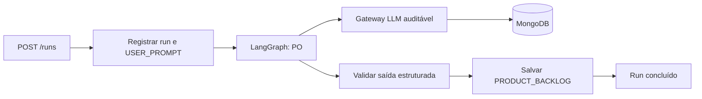

# Plano do backend inicial — PO com LangGraph e auditoria

## 1. Escopo desta primeira implementação

Construir somente o backend que recebe um prompt, chama um agente Product Owner e
retorna requisitos e histórias de usuário. Não haverá DEV, QA, geração de código,
workspace, Git ou sandbox nesta fase.

O fluxo inicial é curto e propositalmente simples:



## 2. Contrato do PO

**Entrada:** prompt do usuário e system prompt versionado do PO.

**Saída estruturada:**

```json
{
  "summary": "Resumo do entendimento",
  "requirements": [
    {"id": "RF-001", "description": "...", "priority": "must"}
  ],
  "user_stories": [
    {
      "id": "US-001",
      "title": "...",
      "as_a": "...",
      "i_want": "...",
      "so_that": "...",
      "acceptance_criteria": ["..."],
      "priority": "must"
    }
  ],
  "assumptions": ["..."],
  "open_questions": ["..."]
}
```

O PO não escreve arquivos, não escolhe stack, não chama ferramentas e não aprova
o próprio resultado. A validação Pydantic rejeita saída sem requisitos ou histórias
e registra a tentativa no fluxo.

## 3. Estrutura de pastas proposta

```text
code/backend/
├── pyproject.toml
├── .env.example
├── main.py                        # composição FastAPI
├── config.py                      # perfis de modelo e configurações versionadas
├── container.py                   # composição das dependências
├── agents/
│   └── product_owner/
│       ├── agent.py               # PO escolhe seu perfil de LLM
│       └── system_prompt.md       # prompt versionado
├── application/                   # casos de uso e cálculo de custo
├── domain/
│   ├── models/                    # um arquivo Pydantic por conceito de domínio
│   └── ports/                     # contratos para LLM e repositório
├── pipeline/                      # grafo LangGraph do PO
├── infrastructure/                # LLMs, MongoDB, memória e relógio
├── routes/                        # endpoints por recurso: runs.py, health.py
└── tests/
    ├── test_api.py
    └── test_po_flow.py
```

`domain/` não importa FastAPI, LangGraph, PyMongo/Motor nem SDK de LLM. LangGraph
fica em `pipeline/`; MongoDB e o provedor são detalhes em `infrastructure/`.

## 4. Endpoints iniciais

| Método | Rota | Resultado |
|---|---|---|
| `POST` | `/runs` | Recebe `prompt`, cria run e inicia o grafo. Devolve `202` e `run_id`. |
| `GET` | `/runs/{run_id}` | Estado, resumo e totais de token/custo. |
| `GET` | `/runs/{run_id}/result` | Requisitos e histórias aceitos. |
| `GET` | `/runs/{run_id}/audit` | Mensagens, chamadas LLM e eventos do fluxo em ordem. |
| `GET` | `/health` | Saúde da API, MongoDB e configuração não sensível. |

O primeiro `POST` pode executar o grafo em tarefa assíncrona local. Uma fila só
deve ser avaliada após o fluxo e a auditoria estarem estáveis.

## Configuração inicial do PO com Gemini

O arquivo `.env` contém somente a chave:

```dotenv
GEMINI_API_KEY=sua_chave
```

Provider e modelo do PO são decisões versionadas em `code/backend/config.py`,
na constante `AGENT_LLM_PROFILES`. Hoje o PO escolhe `gemini-3.6-flash`. Quando DEV
e QA forem adicionados, cada um receberá outro perfil nessa mesma lista, sem alterar
o `.env`. A API registra provider, modelo e demais parâmetros no item `LLM_CALL` da
auditoria, mas nunca registra a chave.

## 5. Plano de implementação

| Etapa | Entrega | Critério de pronto |
|---|---|---|
| 1. Fundação | Projeto Python, configuração, FastAPI, Docker Compose com MongoDB e health check. | API sobe e valida conexão sem expor segredos. |
| 2. Modelo Mongo | Coleção `runs`, validador e índices do documento agregado. | Inserções inválidas são recusadas; um `findOne` por `run_id` traz o histórico. |
| 3. Auditoria | `AuditRecorder`, relógio UTC/Brasília e `CostCalculator`. | Um fluxo fake acrescenta itens de timeline para entrada, chamada e eventos. |
| 4. PO fake | Contratos Pydantic, agente PO e LangGraph de um nó usando LLM fake. | `POST /runs` produz backlog determinístico e auditável. |
| 5. LLM real | Adaptador do provedor configurado por ambiente e gateway auditável. | Tokens, latência, modelo, esforço e custo são persistidos. |
| 6. API de consulta | Endpoints de status, resultado e auditoria paginada. | Usuário consulta um run sem acessar Mongo diretamente. |
| 7. Qualidade | Testes, reconciliação de totais e documentação operacional. | Testes unitários, integração Mongo e e2e passam. |

## 6. Testes obrigatórios antes de adicionar DEV/QA

- o mesmo prompt cria `USER_PROMPT`, `SYSTEM_PROMPT`, `LLM_PROMPT`,
  `LLM_RESPONSE`, `AGENT_RESULT` e eventos esperados;
- `brasil_datetime` existe e representa o mesmo instante de `timestamp`;
- erro/timeout do provedor produz `LLM_CALL_FAILED`, custo/tokens conhecidos e run
  em estado terminal apropriado;
- retry não duplica chamada nem custo quando a chave de idempotência já concluiu;
- soma das chamadas `LLM_CALL` na timeline coincide com `audit.totals`;
- saída inválida do PO não gera `PRODUCT_BACKLOG` aceito;
- o endpoint de auditoria retorna conteúdo, remetente, destinatário, modelo,
  agente, system prompt, esforço, tokens, custo, tentativa e latência.

## 7. Próximo incremento depois desta fase

Somente quando este caminho estiver testado: adicionar um nó DEV, contratos de
handoff e workspace isolado. QA, execução de código e suporte a projetos existentes
entram em incrementos posteriores, reaproveitando as mesmas coleções de auditoria.
