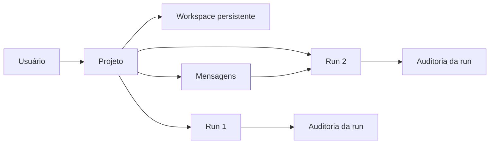
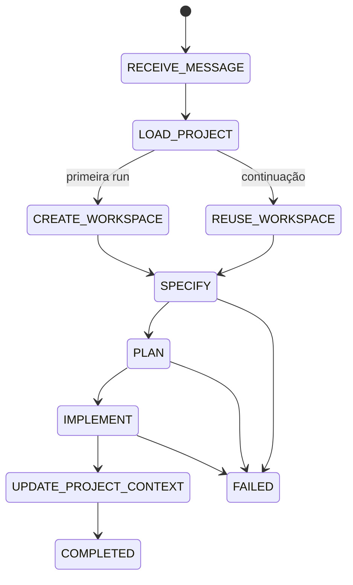

# Plano de implementação — projetos com contexto contínuo

## Objetivo

Permitir que o usuário continue trabalhando no mesmo projeto após a primeira
execução. Uma nova instrução deve usar o código, decisões e histórico daquele
projeto, sem copiar o template novamente.

## Conceitos

| Conceito | O que representa | Exemplo |
|---|---|---|
| `project` | Produto persistente e seu workspace | Calculadora de lucro líquido |
| `run` | Uma execução auditável dentro do projeto | Implementar cálculo de impostos |
| `message` | Uma instrução do usuário para o projeto | “Adicione exportação em PDF” |

Um projeto possui muitos `runs` e muitas mensagens. Cada `run` pertence a um
único projeto. O workspace pertence ao projeto, e não à run.



## Modelo MongoDB

Continuar usando documentos agregados, sem transformar o banco em relacional.

### Coleção `projects`

Um documento por aplicação criada.

```json
{
  "_id": "project_...",
  "name": "calculadora-lucro",
  "status": "ACTIVE",
  "workspace": {
    "path": "C:\\FullStackAgents\\workspaces\\calculadora-lucro_...\\codigo",
    "template": "code/template",
    "created_from_run_id": "run_..."
  },
  "context": {
    "summary": "Resumo técnico e funcional atual do projeto.",
    "decisions": [],
    "backlog": [],
    "last_run_id": "run_..."
  },
  "messages": [
    {
      "id": "msg_...",
      "role": "user",
      "content": "Adicione exportação em PDF.",
      "timestamp": "...",
      "brasil_datetime": "..."
    }
  ],
  "timestamp": "...",
  "brasil_datetime": "..."
}
```

As mensagens ficam embutidas inicialmente. Caso um projeto se aproxime do limite
de 16 MB do MongoDB, elas serão movidas para `project_messages`, com `project_id`
e paginação.

### Coleção `runs`

Manter a auditoria atual e adicionar referências simples:

```json
{
  "_id": "run_...",
  "project_id": "project_...",
  "trigger_message_id": "msg_...",
  "mode": "CREATE_PROJECT | CONTINUE_PROJECT",
  "workspace_snapshot": {
    "revision_before": "...",
    "revision_after": "..."
  }
}
```

Cada run continua autossuficiente para auditoria: prompt, respostas, tokens,
eventos e artefatos ficam nela. O projeto guarda somente o contexto vivo e a
referência ao workspace.

## API proposta

| Método | Rota | Finalidade |
|---|---|---|
| `POST` | `/projects` | Cria projeto, primeira mensagem e primeira run. |
| `GET` | `/projects` | Lista projetos resumidamente. |
| `GET` | `/projects/{project_id}` | Retorna dados, contexto e última run. |
| `POST` | `/projects/{project_id}/messages` | Registra uma nova instrução e cria uma run de continuação. |
| `GET` | `/projects/{project_id}/messages` | Histórico paginado de mensagens. |
| `GET` | `/projects/{project_id}/runs` | Lista runs do projeto. |
| `GET` | `/runs/{run_id}` | Mantém a consulta detalhada já existente. |

Exemplo de continuação:

```json
POST /projects/project_123/messages
{
  "content": "Agora adicione exportação dos cálculos em PDF.",
  "requested_by_id": "thiago"
}
```

O backend primeiro persiste a mensagem, depois cria e executa a nova run. Assim,
nenhum pedido do usuário se perde, mesmo se o agente ou a LLM falharem.

## Contexto enviado aos agentes

Não enviar toda a auditoria de todas as runs à LLM. Isso gastaria tokens demais e
traria ruído. Para cada run de continuação, montar:

1. mensagem nova do usuário;
2. resumo persistido do projeto;
3. backlog e decisões ainda vigentes;
4. resumo da última run concluída;
5. leitura do workspace atual pelo DEV/CODER.

O contexto completo e imutável continua disponível para consulta na API e no
MongoDB, mas somente a seleção necessária entra no prompt.

## Fluxo LangGraph



`CREATE_WORKSPACE` só ocorre na primeira run. Em continuações, `REUSE_WORKSPACE`
valida e reutiliza o workspace já registrado no projeto.

## Etapas de implementação

### 1. Domínio e persistência

- Criar `Project`, `ProjectMessage` e `RunMode` em `domain/models`.
- Criar `ProjectRepository` em `domain/ports`.
- Implementar repositórios MongoDB e memória para projetos.
- Criar índices MongoDB para `projects.status`, `projects.brasil_datetime` e
  `runs.project_id`.
- Adicionar `project_id`, `trigger_message_id` e `mode` ao documento de run.

**Pronto quando:** é possível criar e consultar um projeto sem chamar LLM.

### 2. Casos de uso e API

- Criar `ProjectService` para criação e consulta de projetos.
- Criar `POST /projects` com persistência da primeira mensagem antes da run.
- Criar `POST /projects/{id}/messages` com persistência antes da run.
- Criar listagens resumidas e paginação de mensagens/runs.
- Manter `POST /runs` temporariamente como compatibilidade; ele cria um projeto
  implícito ou responde com orientação de migração.

**Pronto quando:** uma mensagem nova gera uma run ligada ao projeto correto.

### 3. Workspace persistente e isolamento

- Alterar `WorkspaceManager`: criar workspace apenas no modo `CREATE_PROJECT`.
- Adicionar `open_project_workspace(project)` para continuação.
- Validar que o caminho ainda está dentro de `DEV_WORKSPACE_ROOT`.
- Registrar hashes ou revisão Git antes e depois de cada run.

**Pronto quando:** duas runs do mesmo projeto usam o mesmo `code_path`.

### 4. Contexto do grafo e agentes

- Adicionar ao estado LangGraph: `project_id`, mensagem disparadora, modo,
  contexto resumido e workspace.
- Fazer o PO transformar a nova mensagem em alteração de backlog, não recriar o
  produto inteiro.
- Fazer DEV e CODER lerem o workspace persistente.
- Após sucesso, atualizar `project.context.summary`, decisões, backlog e última
  run de forma atômica.

**Pronto quando:** “adicione X” preserva o que foi criado por uma run anterior.

### 5. Auditoria, recuperação e limites

- Auditar mensagem recebida, contexto selecionado e run criada.
- Preservar tokens e custos por run, sem misturar custos de projetos diferentes.
- Se uma run falhar, manter a mensagem e permitir uma nova tentativa no mesmo
  projeto, sem recriar o workspace.
- Limitar mensagens embutidas e implementar paginação antes de atingir 16 MB.

**Pronto quando:** uma run falha sem apagar projeto, código ou conversa anterior.

### 6. Testes e migração

- Unitários para criação, continuação, isolamento de paths e seleção de contexto.
- Integração: criar projeto → executar run → enviar mensagem → executar nova run
  no mesmo workspace.
- Testar falha no DEV e reexecução posterior.
- Atualizar coleção Postman, `instruction.md`, arquitetura e ADR.

**Pronto quando:** o fluxo completo é reproduzível com MongoDB e LLM fake.

## Decisões de segurança

- Uma mensagem não pode escolher um caminho de workspace.
- O modelo não recebe segredos, `.env` ou histórico integral sem necessidade.
- Nunca sobrescrever o workspace de outro `project_id`.
- Em falha, não desfazer automaticamente alterações já gravadas; registrar diff e
  deixar a próxima run decidir como continuar.

## Ordem recomendada

Implementar as etapas 1 e 2 primeiro. Depois validar a API com repositório em
memória. Só então alterar o workspace e o LangGraph nas etapas 3 e 4. Isso evita
misturar mudança de banco, API e execução de código em uma única alteração difícil
de depurar.
